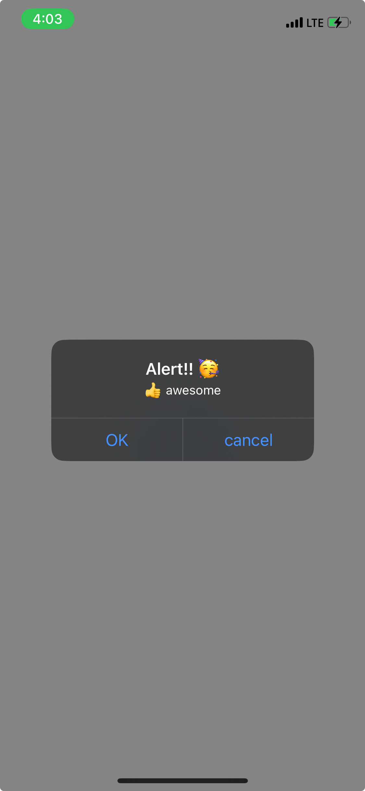
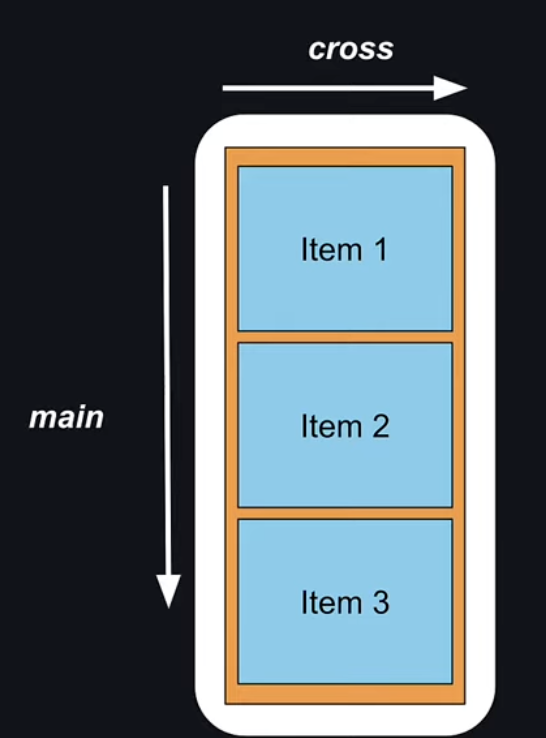

## View

> [!IMPORTANT]
> compoment 사이에 공백 혹은 택스트가 있을 경우 에러를 주기 때문에 조심해야 한다.

```jsx
import { View } from "react-native"

export default function ViewTutorial() {
  return (
    <View style={{ flex: 1, backgroundColor: 'plum' }}>
      <View style={{ width: 100, height: 100, backgroundColor: 'lightblue' }}></View>
    </View>
  )
}
```

간단한 view를 만드는 실습을 하였다

## Text

> [!IMPORTANT]
> ```Text```를 사용하지 않는 경우 화면이 에러인 사항을 마주하게 된다 조심하자

```jsx
import { Text } from "react-native"

export default function TextTutorial() {
  return (
    <Text>
      Test 를 위한 문자입력
    </Text>
  )
}
```

## Image

```jsx
import React from 'react'
import { Image } from 'react-native'
import adaptive from '@/assets/adaptive-icon.png'

const adaptive_icon = require("../../assets/adaptive-icon.png")

function ImageTutorial() {
  return (
    <>
    <Image source={adaptive} style={{ width: 300, height: 300 }}></Image>
      <Image source={adaptive_icon} style={{ width: 300, height: 300 }}></Image>
      <Image
        source={{ uri: "https://picsum.photos/300" }}
        style={{ width: 300, height: 300 }}>
      </Image>
    </>
  )
}

export default ImageTutorial
```

> [!TIP]
> 이미지의 경우 2가지 방법으로 불러오는 방법이 있다. 기본적인 </br>
> 기본적인 ```require```과 ```import icon from '@/*'```  이다. </br>
> 필자는 2번째 방법을 선호하여 설정을 업데이트 해주었다

🍝 global.d.ts

```ts filename="global.d.ts"
declare module '*.png' {
  const value: import('react-native').ImageSourcePropType;
  export default value;
}
```

```import``로 파일 불러오기가 가능해 졌다

추가로 ```@```문자로 root 폴더에 접속하게 추가를 해주자

🍝 tsconfig.json

```json filename="tsconfig.json"
{
  "compilerOptions": {
    "baseUrl": ".",
    "paths": {"@/*": ["./*"]}
  },
  "extends": "expo/tsconfig.base"
}
```

이제 편하게 사용이 가능하다

## ScrollView

스크롤 뷰는 스크롤이 안되는 기본 view를 스크롤 가능한 형식으로 바꿔준다\
부분적으로 스크롤화 할 수도 있어서 필요한 부분에만 넣어주는것으로 좀더 UX 적인 앱이 만들어 진다

```jsx
import React from 'react'
import { ScrollView } from 'react-native'


function ScrollViewTutorial( props : React.PropsWithChildren) {
  return (
    <ScrollView style={{flex:1, backgroundColor: "oriange", margin:3}}>
      {props.children}
    </ScrollView>
  )
}

export default ScrollViewTutorial
```

## Button

버튼을 만들어 준다\
아직 버튼을 꾸미는 방법을 모르겠다 추후 알아 가보자

```jsx
import React from 'react'
import { Button } from 'react-native'

function ButtonTutorial() {
  return (
    <Button title="Press" color="midnightblue"  onPress={()=>{console.log("button pressed")}} />
  )
}

export default ButtonTutorial
```

## Pressable


앱의 눌림 동작을 감지한다.\
이러한 동작은 여러가지 함수를 제공하는데 길게 누르기 때기 등 다양한 함수를 사용할 수 있으니 참고하자

```jsx
import React from 'react'
import { Pressable } from 'react-native'

function PressableTutorial(props: React.PropsWithChildren) {
  return (
    <Pressable onPress={()=> {console.log("pressable pressed")}}>{props.children}</Pressable>
  )
}

export default PressableTutorial
```

## Modal

모달이란?\
모달은 한특정 컴포넌트를 어떠한 방식으로 화면에 표현할지 보여주는 거같다.\
특별한 차이점이라고 하면 앱스타일로 새로운 창에 띄워주기 혹은 슬라이드로 나와 보여주기등 다양한 방법으로 액티브하게 만들어 줄수 있는거 같다.

```jsx
import React, { useState } from 'react'
import { Button, Modal, ModalProps, Text, View } from 'react-native'

type ModalTutorialProps = {
  options?: ModalProps
} & React.PropsWithChildren
function ModalTutorial(props : ModalTutorialProps) {
  const [modalVisible, setModalVisible] = useState(false);

  return (
    <View>
      <Button title='Press' color={'midnightblue'} onPress={() => { setModalVisible(true) }}></Button>
      <Modal visible={modalVisible}
      onRequestClose={() => {
        setModalVisible(false)
      }}
      animationType='slide'
      presentationStyle='pageSheet'
      >
        <View style={{ flex: 1, backgroundColor: "lightblue", padding: 60 }}>
          <Text>Modal start</Text>
          <Button title="Close" color="midnightblue" onPress={() => { setModalVisible(false) }}></Button>
        </View>
      </Modal>
    </View>
  )
}

export default ModalTutorial
```

## StatusBar

| 기능 | ios | android |
| :-: | :-: | :-: |
| backgroundColor | ❌ | ✅ |
| barStyle | ✅ | ✅ |
| hidden | ✅ | ✅ |

안드로이드와 ios에서 다른 부분이 있기에 주의하며 사용해야겠다

```jsx
import React from 'react'
import { StatusBar } from 'react-native'

function StatusBarTutorial() {
  return (
    <StatusBar backgroundColor="lightgreen" barStyle='dark-content' hidden={false}/>
  )
}

export default StatusBarTutorial
```

## ActivityIndicator

무언가 작업중을 나타네는 애니메이션을 만들때 유용하다

```jsx
import React from 'react'
import { ActivityIndicator, View } from 'react-native'

function ActivityIndicatorTutorial() {
  return (
    <View>
      <ActivityIndicator />
      <ActivityIndicator size='large' />
      <ActivityIndicator size='large' color="yellow" />
      <ActivityIndicator size='large' color="midnightblue" animating={true} />
      <ActivityIndicator size='large' color="midnightblue" animating={false} />
    </View>
  )
}

export default ActivityIndicatorTutorial
```

## Alert

알림을 팝업해주는 컴포넌트다



```jsx
import React from 'react'
import { Alert, Button, View } from 'react-native'

function AlertTutoriai() {
  return (
    <View>
      <Button title="Alert" onPress={() => { Alert.alert("Alert!! 🥳") }}/>
      <Button title="Alert With message" onPress={() => { Alert.alert("Alert!! 🥳", "👍 awesome") }}/>
      <Button title="Alert With Button" onPress={() => {
        Alert.alert("Alert!! 🥳", "👍 awesome", [
          {
            text: 'OK',
            onPress: () => { console.log("OK press")}
          },
          {
            text: 'cancel',
            onPress: () => {console.log("Cancel press")}
          },
        ])
      }}/>
    </View>
  )
}

export default AlertTutoriai
```

## CustomComponents

내마음대로 커스텀 해보기\
나중에 좀더 편하게 사용하기 위해 컴포넌트 화 하는 작업이다

```jsx
import React from 'react'
import { Alert, Button, ScrollView, Text, View } from 'react-native'
import AlertTutoriai from './AlertTutoriai'
import InfoApp from '../InfoApp'

function CustomComponentsTutorial() {
  return (
    <View>
      <View style={{backgroundColor:"green", margin:30}}>
        <Text>여기는 커스텀한 컴포넌트 입니다</Text>
      </View>
      <Button title="Alert" onPress={() => { Alert.alert("Alert!! 🥳") }} />
      <ScrollView style={{ backgroundColor: "orange" }}>
        <InfoApp />
      </ScrollView>
    </View>
  )
}

export default CustomComponentsTutorial
```

## StyleSheet

react native에서는 css 를 사용하기 까다롭다\
js 기반으로 작성이 되어야 하기때문으로 알고있는데 \
이러한 상황을 보다 보기 좋게 ```StyleSheet```를 이용해서 작성할 수 도 있고\
```tailwind```가 익숙하다면 ```NativeWind```라는 react native용 ```tailwind```를 사용해도 좋은거 같다

```jsx
import React from 'react'
import { StyleSheet, Text, View } from 'react-native'

function StyleSheetTutorial() {
  return (
    <View style={styles.container}>
        <Text>Style이 잘 적용됩니다</Text>
    </View>
  )
}

const styles = StyleSheet.create({
  container: { flex: 1, backgroundColor:"plum", width:"100%" }
})

export default StyleSheetTutorial
```

## Multiple Styles

여러개의 스타일을 적용시키는 방법이다

```jsx
import React from 'react'
import { StyleSheet, Text, View } from 'react-native'

function StyleSheetTutorial() {
  return (
    <View style={styles.container}>
      <Text>Style이 잘 적용됩니다</Text>
      <View style={[styles.box, styles.lightblue]}>
        <Text>Blue Box</Text>
      </View>
      <View style={[styles.box, styles.lightgreen]}>
        <Text>Green Box</Text>
      </View>
    </View>
  )
}

const styles = StyleSheet.create({
  container: { flex: 1, backgroundColor: "plum", width: "100%" },
  box: {
    width: 100,
    height: 100,
    padding: 10,
  },
  lightblue: {
    backgroundColor: 'lightblue',
  },
  lightgreen: {
    backgroundColor: 'lightgreen',
  }
})

export default StyleSheetTutorial
```

## Shadow Styles

| 기능 | ios | android |
| :-: | :-: | :-: |
| shadowColor | ✅ | ✅ |
| shadowOpacity | ✅ | ❌ |
| shadowRadius | ✅ | ❌ |
| elevation | ❌ | ✅ |

쉐도우 부분은 안드로이드와 ios부분이 2개가 다르기 때문에 잘 참조하면서 적용시킬 필요가 보인다

## style ingeritance

style의 상속 계념이 없는듯 하다\
그럼으로 ```Text```와 ```View```를 따로 설정해야 하지만\
```Text``` 상속 끼리는 예외적으로 적용이 된다는것을 참고할 수 있다

```jsx
import React from 'react'
import { StyleSheet, Text, View } from 'react-native'

function StyleSheetTutorial() {
  return (
    <View style={styles.container}>
      <View style={[styles.darkMode]}>
        <Text style={[styles.darkModeText]}><Text style={[styles.BoldText]}>Style</Text>이 잘 적용됩니다</Text>
      </View>
      <View style={[styles.box, styles.lightblue, styles.boxShadow]}>
        <Text>Blue Box</Text>
      </View>
      <View style={[styles.box, styles.lightgreen, styles.androidShadow]}>
        <Text>Green Box</Text>
      </View>
    </View>
  )
}

const styles = StyleSheet.create({
  darkMode: {
    backgroundColor: 'black'
  },
  darkModeText: {
    color: "white"
  },
  BoldText: {
    fontWeight: "bold"
  },
  container: { flex: 1, backgroundColor: "plum", width: "100%" },
  box: {
    width: 100,
    height: 100,
    padding: 10,
    margin: 10,
    borderWidth: 2,
    borderColor: "white",
    borderRadius: 20,
  },
  lightblue: {
    backgroundColor: 'lightblue',
  },
  lightgreen: {
    backgroundColor: 'lightgreen',
  },
  boxShadow: {
    shadowOffset: {
      width: 6,
      height: 6
    },
    shadowOpacity: 0.6,
    shadowRadius: 4
  },
  androidShadow: {
    elevation: 10,
  }
})

export default StyleSheetTutorial
```

## Layout With FlexBox

flex는 화면을 사용하여 item들을 배분하는 모향을 가지는 display이다

> [!WARNING]
> axes 축이 기본적인 방향과 많이 다르다

기본적인 axes

|용어 | 축 | 설명|
| :-: | :-: | :--|
|main| x축 | 왼쪽에서 오른쪽|
|cross| y축  | 위에서 아래로|


react_native axes

|용어 | 축 | 설명|
| :-: | :-: | :--|
|main| y축 | 위에서 아래로 |
|cross| x축  | 왼쪽에서 오른쪽 |



## Code Setup

box 스타일을 컴포넌트로 만들어보자

```jsx
import React from 'react'
import { StyleSheet, Text, View, ViewStyle } from 'react-native'

type BoxStyleProps = {
  style : ViewStyle
} & React.PropsWithChildren

function BoxStyle(props : BoxStyleProps ) {

  return (
    <View style={[styles.box, props.style]}>
      <Text style={styles.text}>{props.children}</Text>
    </View>
  )
}

const styles = StyleSheet.create({
  box : {
    backgroundColor: 'black',
    padding:20,
    margin:2,
    minWidth:240,
    borderRadius:30
  },
  text:{
    fontSize:24,
    fontWeight:"bold",
    textAlign:"center",
    color:"white"
  }
})

export default BoxStyle
```

이제 이 박스들을 간단한 코드로 여러개를 만들 수 있다

```jsx
import { Button, Modal, StyleSheet, Text, View } from 'react-native';
import ModalTutorial from './components/tutorial/ModalTutorial';
import StatusBarTutorial from './components/tutorial/StatusBarTutorial';
import ActivityIndicatorTutorial from './components/tutorial/ActivityIndicatorTutorial';
import AlertTutoriai from './components/tutorial/AlertTutoriai';
import CustomComponentsTutorial from './components/tutorial/CustomComponentsTutorial';
import StyleSheetTutorial from './components/tutorial/StyleSheetTutorial';
import BoxStyle from './components/BoxStyle';

export default function App() {

  return (
    <View style={styles.container}>
    <BoxStyle style={{backgroundColor:"#1c4c56"}}>1c4c56</BoxStyle>
      <BoxStyle style={{backgroundColor:"#ffbbbb"}}>ffbbbb</BoxStyle>
      <BoxStyle style={{backgroundColor:"#1eae98"}}>1eae98</BoxStyle>
      <BoxStyle style={{backgroundColor:"#6fd6ff"}}>6fd6ff</BoxStyle>
      <BoxStyle style={{backgroundColor:"#fe90af"}}>fe90af</BoxStyle>
      <BoxStyle style={{backgroundColor:"#ff8c8c"}}>ff8c8c</BoxStyle>
      <BoxStyle style={{backgroundColor:"#a890fe"}}>a890fe</BoxStyle>
      <BoxStyle style={{backgroundColor:"#ffffcf"}}>ffffcf</BoxStyle>
      <BoxStyle style={{backgroundColor:"#fca5f1"}}>fca5f1</BoxStyle>
    </View>
  );
}

const styles = StyleSheet.create({
  container: {
    marginTop:30,
    paddingTop: 30,
    backgroundColor: '#ffdfcf',
    alignItems: 'center',
    justifyContent: 'center',
  },
});
```

## Flex

공간을 차지하는 css display 표현이다.\
이러한 공간을 flex의 값으로 또 분배를 할 수 있으며 모든것을 일정하게 배분하기 때문에 사용하기 편하다

## Flex Direction

| 옵션 | 설명 |
| :-- | :--|
| column | 열을 나눈다 (세로를 나눈다) |
| column-reverse | 열의 순서를 뒤집는다 |
| row | 행을 나눈다 (가로를 일정분할한다) |
| row-reverse | 행의 순서를 뒤집는다 |

## JustifyContent

main axis를 담당한다(잊지말자 여긴 세로가 main이다)

| 옵션 | 설명 |
| :-- | :--|
| flex-start | 맨 위를 기준으로 정렬한다 |
| center| 중앙을 기준으로 정렬한다 |
| flex-end | 맨밑을 기준으로 정렬한다 |
| space-around | 남은 공간을 오브젝트 위와 아래에 똑같이 배분한다 |
| space-between | 엘리먼트 사이만 나눠준다 |
| space-evenly | 남은 공간을 오브젝트 사이에 똑같이 배분한다 |

## AlignItems

cross axis를 담당한다(잊지말자 여긴 가로가 cross이다)

| 옵션 | 설명 |
| :-- | :--|
| flex-start | 맨 왼쪽를 기준으로 정렬한다 |
| center| 중앙을 기준으로 정렬한다 |
| flex-end | 맨 오른쪽을 기준으로 정렬한다 |
| baseline | 모든 오브젝트의 중앙값을 제일큰 오브젝트의 중앙으로 설정한다 |
| stretch | 가로를 꽉 체워준다 |

## AlignSelf

이 컴포넌트를 상위 컨포넌트의 영향을 받지않고 설정한 값의 영향을 받도록 한다
기본적으로는 auto로 상위 옵션을 따라간다
