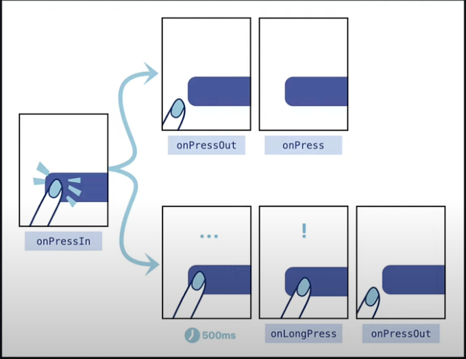
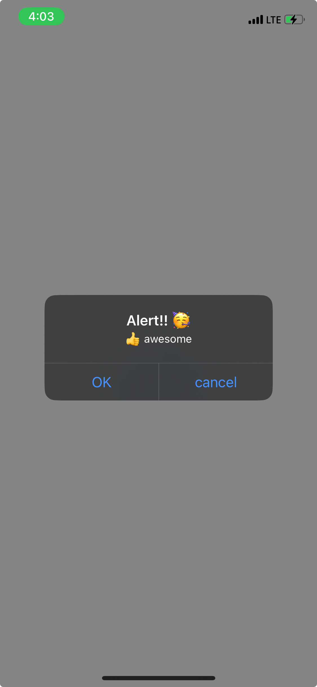

## View

> [!IMPORTANT]
> compoment 사이에 공백 혹은 택스트가 있을 경우 에러를 주기 때문에 조심해야 한다.

```jsx
import { View } from "react-native"

export default function ViewTutorial() {
  return (
    <View style={{ flex: 1, backgroundColor: 'plum' }}>
      <View style={{ width: 100, height: 100, backgroundColor: 'lightblue' }}></View>
    </View>
  )
}
```

간단한 view를 만드는 실습을 하였다

## Text

> [!IMPORTANT]
> ```Text```를 사용하지 않는 경우 화면이 에러인 사항을 마주하게 된다 조심하자

```jsx
import { Text } from "react-native"

export default function TextTutorial() {
  return (
    <Text>
      Test 를 위한 문자입력
    </Text>
  )
}
```

## Image

```jsx
import React from 'react'
import { Image } from 'react-native'
import adaptive from '@/assets/adaptive-icon.png'

const adaptive_icon = require("../../assets/adaptive-icon.png")

function ImageTutorial() {
  return (
    <>
    <Image source={adaptive} style={{ width: 300, height: 300 }}></Image>
      <Image source={adaptive_icon} style={{ width: 300, height: 300 }}></Image>
      <Image
        source={{ uri: "https://picsum.photos/300" }}
        style={{ width: 300, height: 300 }}>
      </Image>
    </>
  )
}

export default ImageTutorial
```

> [!TIP]
> 이미지의 경우 2가지 방법으로 불러오는 방법이 있다. 기본적인 </br>
> 기본적인 ```require```과 ```import icon from '@/*'```  이다. </br>
> 필자는 2번째 방법을 선호하여 설정을 업데이트 해주었다

🍝 global.d.ts

```ts filename="global.d.ts"
declare module '*.png' {
  const value: import('react-native').ImageSourcePropType;
  export default value;
}
```

```import``로 파일 불러오기가 가능해 졌다

추가로 ```@```문자로 root 폴더에 접속하게 추가를 해주자

🍝 tsconfig.json

```json filename="tsconfig.json"
{
  "compilerOptions": {
    "baseUrl": ".",
    "paths": {"@/*": ["./*"]}
  },
  "extends": "expo/tsconfig.base"
}
```

이제 편하게 사용이 가능하다

## ScrollView

스크롤 뷰는 스크롤이 안되는 기본 view를 스크롤 가능한 형식으로 바꿔준다\
부분적으로 스크롤화 할 수도 있어서 필요한 부분에만 넣어주는것으로 좀더 UX 적인 앱이 만들어 진다

```jsx
import React from 'react'
import { ScrollView } from 'react-native'


function ScrollViewTutorial( props : React.PropsWithChildren) {
  return (
    <ScrollView style={{flex:1, backgroundColor: "oriange", margin:3}}>
      {props.children}
    </ScrollView>
  )
}

export default ScrollViewTutorial
```

## Button

버튼을 만들어 준다\
아직 버튼을 꾸미는 방법을 모르겠다 추후 알아 가보자

```jsx
import React from 'react'
import { Button } from 'react-native'

function ButtonTutorial() {
  return (
    <Button title="Press" color="midnightblue"  onPress={()=>{console.log("button pressed")}} />
  )
}

export default ButtonTutorial
```

## Pressable



앱의 눌림 동작을 감지한다.\
이러한 동작은 여러가지 함수를 제공하는데 길게 누르기 때기 등 다양한 함수를 사용할 수 있으니 참고하자

```jsx
import React from 'react'
import { Pressable } from 'react-native'

function PressableTutorial(props: React.PropsWithChildren) {
  return (
    <Pressable onPress={()=> {console.log("pressable pressed")}}>{props.children}</Pressable>
  )
}

export default PressableTutorial
```

## Modal

모달이란?\
모달은 한특정 컴포넌트를 어떠한 방식으로 화면에 표현할지 보여주는 거같다.\
특별한 차이점이라고 하면 앱스타일로 새로운 창에 띄워주기 혹은 슬라이드로 나와 보여주기등 다양한 방법으로 액티브하게 만들어 줄수 있는거 같다.

```jsx
import React, { useState } from 'react'
import { Button, Modal, ModalProps, Text, View } from 'react-native'

type ModalTutorialProps = {
  options?: ModalProps
} & React.PropsWithChildren
function ModalTutorial(props : ModalTutorialProps) {
  const [modalVisible, setModalVisible] = useState(false);

  return (
    <View>
      <Button title='Press' color={'midnightblue'} onPress={() => { setModalVisible(true) }}></Button>
      <Modal visible={modalVisible}
      onRequestClose={() => {
        setModalVisible(false)
      }}
      animationType='slide'
      presentationStyle='pageSheet'
      >
        <View style={{ flex: 1, backgroundColor: "lightblue", padding: 60 }}>
          <Text>Modal start</Text>
          <Button title="Close" color="midnightblue" onPress={() => { setModalVisible(false) }}></Button>
        </View>
      </Modal>
    </View>
  )
}

export default ModalTutorial
```

## StatusBar

| 기능 | ios | android |
| :-: | :-: | :-: |
| backgroundColor | ❌ | ✅ |
| barStyle | ✅ | ✅ |
| hidden | ✅ | ✅ |

안드로이드와 ios에서 다른 부분이 있기에 주의하며 사용해야겠다

```jsx
import React from 'react'
import { StatusBar } from 'react-native'

function StatusBarTutorial() {
  return (
    <StatusBar backgroundColor="lightgreen" barStyle='dark-content' hidden={false}/>
  )
}

export default StatusBarTutorial
```

## ActivityIndicator

무언가 작업중을 나타네는 애니메이션을 만들때 유용하다

```jsx
import React from 'react'
import { ActivityIndicator, View } from 'react-native'

function ActivityIndicatorTutorial() {
  return (
    <View>
      <ActivityIndicator />
      <ActivityIndicator size='large' />
      <ActivityIndicator size='large' color="yellow" />
      <ActivityIndicator size='large' color="midnightblue" animating={true} />
      <ActivityIndicator size='large' color="midnightblue" animating={false} />
    </View>
  )
}

export default ActivityIndicatorTutorial
```

## Alert

알림을 팝업해주는 컴포넌트다



```jsx
import React from 'react'
import { Alert, Button, View } from 'react-native'

function AlertTutoriai() {
  return (
    <View>
      <Button title="Alert" onPress={() => { Alert.alert("Alert!! 🥳") }}/>
      <Button title="Alert With message" onPress={() => { Alert.alert("Alert!! 🥳", "👍 awesome") }}/>
      <Button title="Alert With Button" onPress={() => {
        Alert.alert("Alert!! 🥳", "👍 awesome", [
          {
            text: 'OK',
            onPress: () => { console.log("OK press")}
          },
          {
            text: 'cancel',
            onPress: () => {console.log("Cancel press")}
          },
        ])
      }}/>
    </View>
  )
}

export default AlertTutoriai
```
